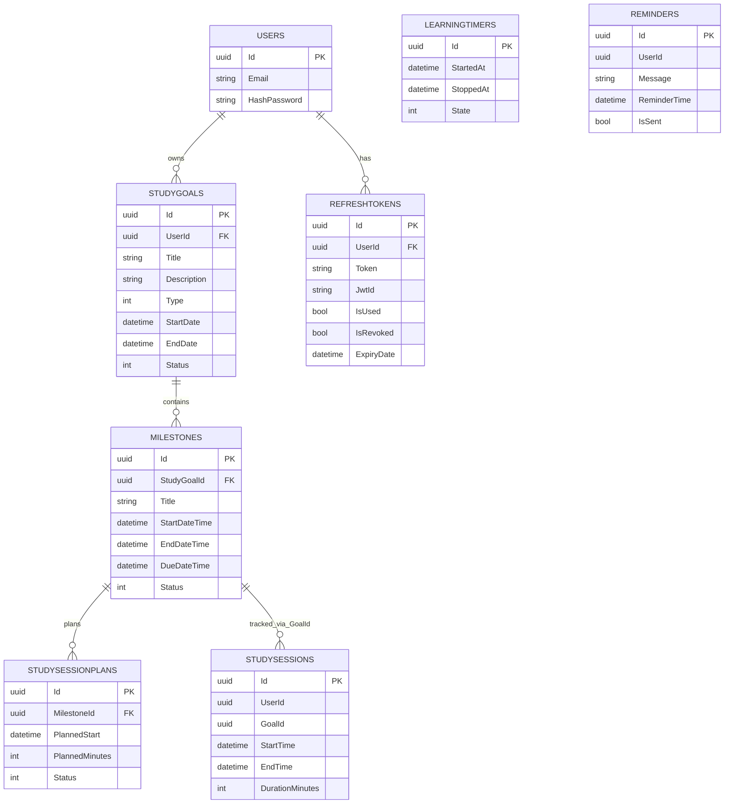

# Datenbankdokumentation mit ERD

## Zweck
Diese Dokumentation beschreibt das persistente Datenmodell der Anwendung, wie es in NoterDbContext und den Entities umgesetzt ist.

## DB-Tabellen und Bedeutung
- Users: Benutzerkonto mit Login-Informationen.
- StudyGoals: Lernziele eines Benutzers.
- Milestones: Teilziele zu einem Lernziel.
- StudySessions: Erfasste Lernzeit-Sessions.
- StudySessionPlans: Geplante Lerneinheiten pro Meilenstein.
- RefreshTokens: Tokens fuer JWT-Erneuerung.
- LearningTimers: Timerzustand (derzeit ohne API-Nutzung).
- Reminders: Erinnerungseintraege (derzeit ohne API-Nutzung).

## ERD (Mermaid)

## Beziehungen im Code
- User 1:n StudyGoal ist explizit in OnModelCreating konfiguriert.
- StudyGoal 1:n Milestone ist explizit in OnModelCreating konfiguriert.
- Milestone 1:n StudySessionPlan ist explizit in OnModelCreating konfiguriert.
- RefreshToken besitzt ein ForeignKey-Attribut auf UserId.
- StudySession verwendet GoalId als Referenz auf Milestone.Id (technisch historisch benannt).

## Enum-Mapping
- GoalStatus: Planned, InProgress, Completed, Failed.
- GoalType: Module, Exam, Project, Assignment, Other.
- SessionStatus: Planned, Completed, Missed.
- TimerState: Running, Paused, Stopped.

## Integritaets- und Fachregeln
- StudyGoal darf nur mit nicht-leerem Title erstellt werden.
- API-seitig sind fuer StudyGoal sowohl Title als auch Description Pflicht.
- Milestone verlangt gueltiges Zeitintervall StartDateTime < EndDateTime.
- StudySession wird nur mit trackedMinutes > 0 angelegt.
- StudyGoal kann nur auf Completed gesetzt werden, wenn alle Milestones Completed sind.

## Bekannte Modellbesonderheiten
- Feldname StudySession.GoalId ist fachlich ein Milestone-Bezug.
- In StudySessionPlanRepository heisst die Lesemethode GetByStudyGoalIdAsync, filtert jedoch MilestoneId.
- StudySessionPlanController und UserController sind aktuell nicht mit Authorize abgesichert.
