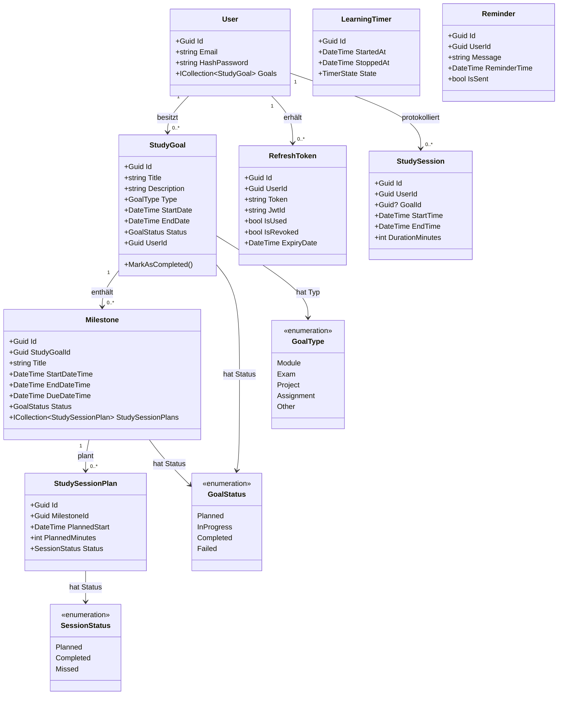
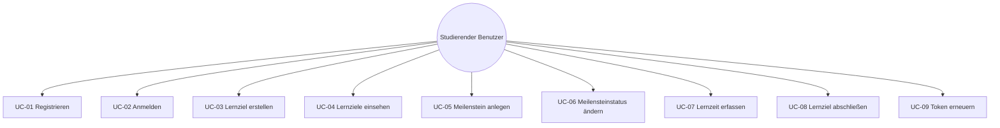

# Fachliche Dokumentation – Lernzeit-Manager

---

## 1. Ausgangssituation und Zielsetzung

### 1.1 Ausgangssituation

Studierende arbeiten typischerweise parallel an mehreren Lernzielen, zum Beispiel Klausurvorbereitung, Projektarbeit oder Hausarbeit. In der Praxis entstehen dabei häufig folgende Probleme:

- Lernziele sind nicht klar strukturiert und werden nur als lose To-do-Listen geführt.
- Konkrete Meilensteine mit Zeitfenstern fehlen.
- Lernzeit wird nicht systematisch erfasst, sodass der Fortschritt schwer messbar ist.
- Es gibt kaum Transparenz darüber, welche Ziele bereits abgeschlossen sind.
- Abgeschlossene und laufende Vorhaben sind nicht voneinander getrennt darstellbar.

### 1.2 Zielsetzung

Der Lernzeit-Manager soll diese Probleme lösen, indem er fachlich folgende Ziele erreicht:

- **Strukturierung der Lernplanung** über hierarchisch geordnete Lernziele und Meilensteine.
- **Unterstützung der täglichen Umsetzung** durch Status- und Zeittracking auf Meilensteinebene.
- **Nachvollziehbarkeit des Fortschritts** durch aggregierte Kennzahlen je Lernziel (geplante und absolvierte Lernzeit, Meilensteinquote).
- **Trennung aktiver und abgeschlossener Lernziele** über ein integriertes Archiv.
- **Nutzerbezogene Datenhaltung** durch Authentifizierung und eindeutigen Benutzerkontext für alle Operationen.

---

## 2. Erklärung der Programmprozesse

### 2.1 Registrierung

1. Benutzer übermittelt E-Mail-Adresse und Passwort.
2. Das System prüft, ob die E-Mail-Adresse bereits registriert ist.
3. Das Passwort wird gehasht gespeichert (kein Klartext).
4. Das Benutzerkonto wird angelegt.

**Fachlicher Nutzen:** Jeder Benutzer besitzt einen eigenen, isolierten Lernbereich.

### 2.2 Anmeldeprozess

1. Benutzer gibt E-Mail und Passwort im Frontend ein.
2. Backend prüft die Zugangsdaten anhand des gespeicherten Passwort-Hashes.
3. Bei Erfolg werden ein kurzlebiger **Access Token** (JWT) und ein langlebiger **Refresh Token** erzeugt.
4. Das Frontend speichert den Access Token und übersendet ihn bei jeder geschützten Anfrage im Authorization-Header.
5. Nach Ablauf des Access Tokens kann über den Refresh-Token-Endpunkt ein neues Tokenpaar angefordert werden.

**Fachlicher Nutzen:** Alle Lernziel- und Meilensteinaktionen sind sicher einem konkreten Benutzer zuordenbar.

### 2.3 Lernziel anlegen

1. Benutzer erfasst Titel, Beschreibung, Typ (Modul, Prüfung, Projekt, Aufgabe, Sonstiges) sowie Start- und Enddatum.
2. Das Backend validiert die Pflichtfelder (Titel und Beschreibung dürfen nicht leer sein).
3. Die UserId wird aus dem JWT-Token des angemeldeten Benutzers gesetzt.
4. Das Lernziel wird mit dem Initialstatus Planned persistiert.

**Fachlicher Nutzen:** Aus abstrakten Vorhaben entstehen planbare, terminierte Lernobjekte.

### 2.4 Lernziele einsehen

1. Frontend lädt aktive Lernziele des angemeldeten Benutzers.
2. Parallel werden abgeschlossene Lernziele für das Archiv geladen.
3. Pro Lernziel werden Kennzahlen berechnet und geliefert:
   - `totalTrackedMinutes` – tatsächlich geleistete Lernminuten
   - `totalMilestones` – Gesamtanzahl der Meilensteine
   - `completedMilestones` – Anzahl abgeschlossener Meilensteine

**Fachlicher Nutzen:** Benutzer sehen nicht nur Inhalte, sondern auch den messbaren Fortschritt pro Ziel.

### 2.5 Meilenstein anlegen

1. Benutzer wählt ein bestehendes Lernziel aus.
2. Benutzer erfasst Titel, Startdatum und Enddatum des Meilensteins.
3. Backend validiert:
   - Titel darf nicht leer sein.
   - Startdatum muss zeitlich vor dem Enddatum liegen.
4. Meilenstein wird mit dem Status Planned gespeichert.

**Fachlicher Nutzen:** Lernziele werden in umsetzbare, terminierte Arbeitspakete heruntergebrochen.

### 2.6 Meilensteinstatus ändern

1. Benutzer setzt den Status eines Meilensteins (z. B. InProgress, Completed, Failed).
2. Backend prüft, ob der Meilenstein dem angemeldeten Benutzer zugehört (über das übergeordnete Lernziel).
3. Status wird in der Datenbank aktualisiert.

**Fachlicher Nutzen:** Arbeitsfortschritt kann kontinuierlich und transparent gepflegt werden.

### 2.7 Lernzeit auf Meilenstein buchen

1. Benutzer übermittelt eine Minutenanzahl für einen Meilenstein.
2. Backend validiert: trackedMinutes > 0.
3. Es wird eine StudySession mit Start-/Endzeit und Dauer erzeugt und gespeichert.
4. Diese Sessions fließen in die Statistik je Meilenstein und Lernziel ein.

**Fachlicher Nutzen:** Tatsächlich erbrachte Lernleistung wird messbar und für Auswertungen nutzbar.

### 2.8 Lernziel abschließen

1. Benutzer initiiert den Abschluss eines Lernziels.
2. Backend prüft als **fachliche Vorbedingung**: alle zugeordneten Meilensteine müssen den Status Completed besitzen.
3. Bei Erfolg wird das Lernziel auf Completed gesetzt und in das Archiv überführt.
4. Ist mindestens ein Meilenstein nicht abgeschlossen, wird die Operation mit einer fachlichen Fehlermeldung abgewiesen.

**Fachlicher Nutzen:** Abschluss ist regelkonform und verhindert voreilige oder fehlerhafte Zielschließung.

### 2.9 Token-Erneuerung

1. Access Token des Benutzers ist abgelaufen.
2. Frontend sendet den Refresh Token an den Endpunkt POST /api/Authentication/refresh_token.
3. Das System prüft, ob der Refresh Token gültig, noch nicht verwendet und nicht widerrufen ist.
4. Bei Erfolg werden neue Access- und Refresh-Tokens ausgestellt.

**Fachlicher Nutzen:** Sitzungen bleiben nahtlos erhalten, ohne erneute Passworteingabe.

---

## 3. Fachliche Komponenten und Verantwortungen

| Komponente            | Fachliche Verantwortung                                                                 |
|-----------------------|-----------------------------------------------------------------------------------------|
| Benutzerverwaltung    | Registrierung, Login, Token-Ausstellung und Sitzungsführung                            |
| Lernzielverwaltung    | Erstellen, Laden, Abschließen und Archivieren von Lernzielen mit Kennzahlen            |
| Meilensteinverwaltung | Arbeitspakete je Lernziel mit Zeitrahmen, Statusverwaltung und Zeitbuchung             |
| Zeittracking          | Erfassung realer Lernzeit als StudySessions, Aggregation in Fortschrittskennzahlen    |
| Sitzungsplanung       | Planung künftiger Lerneinheiten (StudySessionPlan) je Meilenstein                     |
| Authentifizierung     | JWT-Erzeugung, Refresh-Token-Verwaltung und Tokenwiderruf                              |

---

## 4. UML-Klassendiagramm (fachliche Sicht)

---

## 5. Use-Cases

### 5.1 Akteure

| Akteur                | Beschreibung                                                |
|-----------------------|-------------------------------------------------------------|
| Studierender Benutzer | Primärakteur; meldet sich an und verwaltet seinen Lernplan  |
| System (API + DB)     | Sekundärakteur; validiert, persistiert und liefert Daten    |

### 5.2 Use-Case-Übersicht

### 5.3 Detaillierte Use-Cases

#### UC-01 – Registrieren

| Feld                 | Inhalt                                                                                           |
|----------------------|--------------------------------------------------------------------------------------------------|
| **Ziel**             | Neues Benutzerkonto anlegen                                                                      |
| **Vorbedingung**     | E-Mail-Adresse noch nicht registriert                                                            |
| **Hauptablauf**      | 1. Benutzer gibt E-Mail und Passwort ein. 2. System hasht das Passwort. 3. Konto wird angelegt.  |
| **Alternativablauf** | E-Mail bereits vorhanden → System meldet Fehler                                                  |

---

#### UC-02 – Anmelden

| Feld                 | Inhalt                                                                                                                  |
|----------------------|-------------------------------------------------------------------------------------------------------------------------|
| **Ziel**             | Zugang zum persönlichen Lernbereich erhalten                                                                            |
| **Vorbedingung**     | Benutzerkonto existiert                                                                                                 |
| **Hauptablauf**      | 1. E-Mail und Passwort eingeben. 2. System validiert Daten. 3. System liefert Access Token und Refresh Token.           |
| **Alternativablauf** | Falsches Passwort → System liefert Fehlermeldung                                                                        |

---

#### UC-03 – Lernziel erstellen

| Feld                 | Inhalt                                                                                                                                          |
|----------------------|-------------------------------------------------------------------------------------------------------------------------------------------------|
| **Ziel**             | Neues Lernziel mit Zeitrahmen erfassen                                                                                                          |
| **Vorbedingung**     | Benutzer ist angemeldet                                                                                                                         |
| **Hauptablauf**      | 1. Benutzer erfasst Titel, Beschreibung, Typ, Start- und Enddatum. 2. System validiert Pflichtfelder. 3. System speichert Lernziel mit Status Planned. |
| **Alternativablauf** | Pflichtfelder fehlen → System meldet 400 Bad Request                                                                                            |

---

#### UC-04 – Lernziele einsehen

| Feld                 | Inhalt                                                                                                                                                       |
|----------------------|--------------------------------------------------------------------------------------------------------------------------------------------------------------|
| **Ziel**             | Aktive und abgeschlossene Lernziele mit Kennzahlen darstellen                                                                                                |
| **Vorbedingung**     | Benutzer ist angemeldet                                                                                                                                      |
| **Hauptablauf**      | 1. System lädt aktive Lernziele. 2. System lädt abgeschlossene Lernziele (Archiv). 3. System liefert je Ziel: Gesamtminuten, Meilensteinanzahl und -quote.   |

---

#### UC-05 – Meilenstein anlegen

| Feld                 | Inhalt                                                                                                                                       |
|----------------------|----------------------------------------------------------------------------------------------------------------------------------------------|
| **Ziel**             | Lernziel in konkrete Arbeitspakete zergliedern                                                                                               |
| **Vorbedingung**     | Lernziel existiert und gehört dem Benutzer                                                                                                   |
| **Hauptablauf**      | 1. Benutzer erfasst Titel, Startdatum und Enddatum. 2. System validiert (Titel nicht leer, Start vor Ende). 3. System speichert Meilenstein mit Status Planned. |
| **Alternativablauf** | Startdatum >= Enddatum → System meldet 400 Bad Request                                                                                       |

---

#### UC-06 – Meilensteinstatus ändern

| Feld                 | Inhalt                                                                                                    |
|----------------------|-----------------------------------------------------------------------------------------------------------|
| **Ziel**             | Fortschritt je Meilenstein pflegen                                                                        |
| **Vorbedingung**     | Meilenstein gehört dem angemeldeten Benutzer                                                              |
| **Hauptablauf**      | 1. Benutzer wählt neuen Status (InProgress, Completed, Failed). 2. System aktualisiert den Datensatz.     |

---

#### UC-07 – Lernzeit erfassen

| Feld                 | Inhalt                                                                                                                |
|----------------------|-----------------------------------------------------------------------------------------------------------------------|
| **Ziel**             | Tatsächliche Lernzeit für einen Meilenstein protokollieren                                                            |
| **Vorbedingung**     | Benutzer ist angemeldet; Meilenstein existiert                                                                        |
| **Hauptablauf**      | 1. Benutzer übergibt Minutenanzahl. 2. System validiert trackedMinutes > 0. 3. System speichert StudySession.         |
| **Alternativablauf** | Minuten <= 0 → System meldet 400 Bad Request                                                                          |

---

#### UC-08 – Lernziel abschließen

| Feld                 | Inhalt                                                                                                                           |
|----------------------|----------------------------------------------------------------------------------------------------------------------------------|
| **Ziel**             | Lernziel regelkonform in das Archiv überführen                                                                                   |
| **Vorbedingung**     | Alle zugehörigen Meilensteine haben Status Completed                                                                             |
| **Hauptablauf**      | 1. Benutzer initiiert Abschluss. 2. System prüft Abschlussbedingung. 3. System setzt Status auf Completed.                       |
| **Alternativablauf** | Mindestens ein Meilenstein nicht Completed → System lehnt Abschluss mit fachlicher Meldung ab                                   |

---

#### UC-09 – Token erneuern

| Feld                 | Inhalt                                                                                                               |
|----------------------|----------------------------------------------------------------------------------------------------------------------|
| **Ziel**             | Abgelaufene Sitzung ohne erneute Passworteingabe verlängern                                                          |
| **Vorbedingung**     | Gültiger, noch nicht verwendeter Refresh Token vorhanden                                                             |
| **Hauptablauf**      | 1. Frontend sendet altes Tokenpaar. 2. System prüft Gültigkeit des Refresh Tokens. 3. System stellt neue Tokens aus. |
| **Alternativablauf** | Token bereits verwendet oder widerrufen → System meldet Fehler                                                       |

---

## 6. Geschäftsregeln

| Nr.   | Geschäftsregel                                                                                                               |
|-------|------------------------------------------------------------------------------------------------------------------------------|
| GR-01 | Ein Lernziel **muss** einen Titel und eine Beschreibung besitzen; beide Felder dürfen nicht leer sein.                      |
| GR-02 | Ein Meilenstein **muss** einen Titel besitzen.                                                                               |
| GR-03 | Bei einem Meilenstein **muss** StartDateTime zeitlich vor EndDateTime liegen.                                                |
| GR-04 | Gebuchte Lernzeit **muss** größer als 0 Minuten betragen.                                                                    |
| GR-05 | Ein Lernziel darf erst abgeschlossen werden, wenn **alle** zugeordneten Meilensteine den Status Completed haben.             |
| GR-06 | Alle Lernziel- und Meilensteinoperationen sind **nutzerbezogen**: Zugriff ist nur auf eigene Daten erlaubt.                  |
| GR-07 | Eine E-Mail-Adresse darf systemweit **nur einmal** als Benutzerkonto existieren.                                             |
| GR-08 | Passwörter werden **nie im Klartext** gespeichert; sie werden vor der Persistierung gehasht.                                 |
| GR-09 | Refresh Tokens dürfen **nicht mehrfach verwendet** werden und müssen gültig (nicht widerrufen, nicht abgelaufen) sein.       |
| GR-10 | Abgeschlossene Lernziele gelten fachlich als **Archiv** und werden getrennt von aktiven Lernzielen abgefragt.                |
| GR-11 | Der Lernzieltyp (GoalType) wird bei der Erstellung festgelegt und bestimmt die fachliche Kategorisierung des Ziels.          |
| GR-12 | Der Status eines Lernziels oder Meilensteins folgt dem Übergang: Planned -> InProgress -> Completed / Failed.                |

---

## 7. Fachliche Abgrenzung und offene Punkte

| Nr. | Offener Punkt                                                                                                                                                             |
|-----|---------------------------------------------------------------------------------------------------------------------------------------------------------------------------|
| 1   | Der CalendarController ist als Endpunkt vorhanden, aber fachlich noch nicht vollständig implementiert.                                                                   |
| 2   | LearningTimer und Reminder sind als Domänenobjekte modelliert, aber aktuell nicht als vollständige Nutzerfunktion ausgebaut.                                             |
| 3   | StudySession referenziert Meilensteine über das Feld GoalId. Die Benennung ist fachlich missverständlich und sollte bei Weiterentwicklung zu MilestoneId vereinheitlicht werden. |
| 4   | Die StudySessionPlan-Endpunkte sind derzeit nicht mit [Authorize] gesichert. Fachlich sollte entschieden werden, ob Planung ausschließlich für angemeldete Benutzer zulässig ist. |
