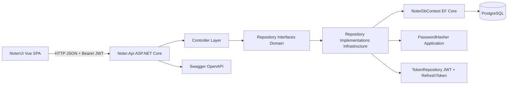
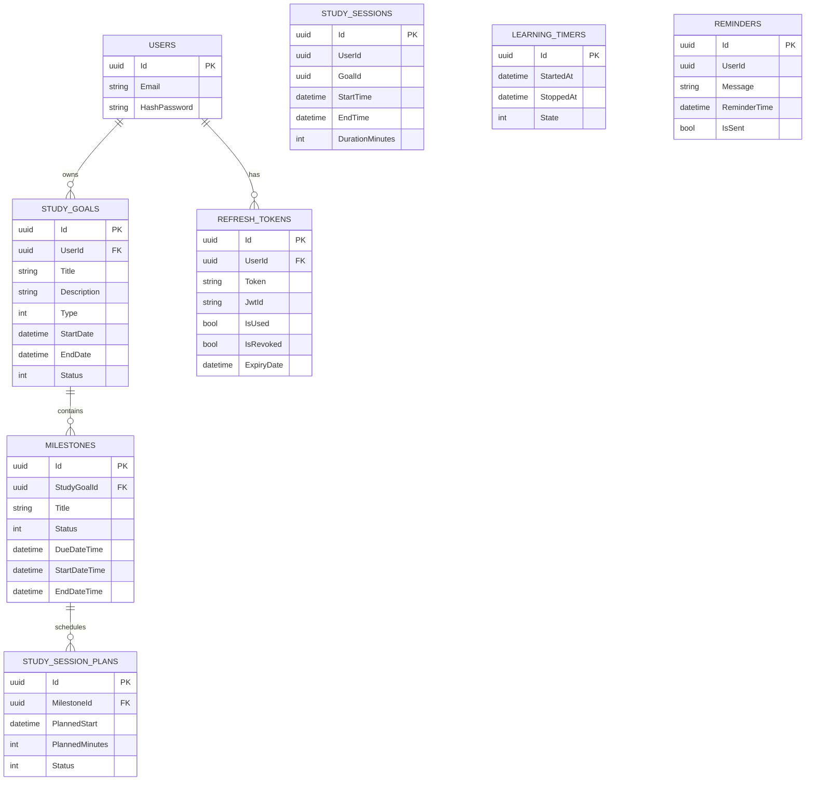

# Technische Dokumentation - Lernzeit-Manager

## 1. Architektur und eingesetzte Technologien

### 1.1 Architekturansatz
Der Lernzeit-Manager ist als mehrschichtige Anwendung umgesetzt:

- Frontend: Single-Page-Application mit Vue 3.
- Backend: ASP.NET Core Web API.
- Datenzugriff: Entity Framework Core mit Repository-Pattern.
- Datenbank: PostgreSQL (Npgsql Provider).
- Authentifizierung: JWT Access Token + Refresh Token.

Die Schichten sind projektseitig in mehrere .NET-Projekte getrennt:

- Noter.Api: API, DI-Konfiguration, Middleware, Security, Hosting.
- Noter.Application: anwendungsnahe Utilities, aktuell insbesondere Passwort-Hashing.
- Noter.Domain: Domänenmodelle (Entities), DTOs, Enums, Repository-Interfaces.
- Noter.Inrastructure: Persistenz, DbContext, Repository-Implementierungen, Token-Handling, EF-Migrationen.
- Noter.Tests: Unit- und Integrationstests.

### 1.2 Technologie-Stack

#### Backend
- .NET 8 (API, Domain, Application, Infrastructure)
- ASP.NET Core Web API
- EF Core 8
- Npgsql.EntityFrameworkCore.PostgreSQL
- JWT Bearer Authentication
- Swashbuckle (Swagger/OpenAPI)
- Microsoft.AspNetCore.Identity (Identity-Typen werden für Token-Erstellung verwendet)

#### Frontend
- Vue 3 (Composition API)
- Vite
- Axios
- JavaScript (ES Modules)

#### Test-Stack
- xUnit
- Moq
- FluentAssertions
- EF Core InMemory (Integrationstests)
- coverlet.collector (Coverage)

### 1.3 Querschnittsthemen
- CORS-Policy AllowVue für http://localhost:5173.
- Automatisches Anwenden von EF-Migrationen beim API-Start.
- Zusätzliches SQL-Kompatibilitäts-Update für Milestone-Spalten beim Start.
- JSON-Serialisierung mit IgnoreCycles zum Schutz vor zyklischen Referenzen.
- Swagger mit Bearer Security Definition.

## 2. Komponentenübersicht

## 3. Beschreibung der Komponenten

### 3.1 Frontend (NoterUI)
Verantwortung:
- Darstellung der Benutzeroberfläche für Login, Lernziele, Meilensteine und Zeiterfassung.
- Verwaltung des Access Tokens im Local Storage.
- Versand von API-Requests über einen zentralen Axios-Client.

Wichtige Bausteine:
- api/http.js: Axios-Basisclient, BaseURL je nach DEV/PROD, 401-Interceptor.
- api/auth.js: Login-Aufruf.
- api/goals.js: Endpunkte für Lernziele (inkl. Archiv abgeschlossener Ziele).
- api/milestones.js: Endpunkte für Meilensteine und Zeit-Tracking.
- App.vue: zentrale UI-Logik inkl. Reminder, Timer, Meldungslogik, Datenladen.

### 3.2 API-Schicht (Noter.Api)
Verantwortung:
- HTTP-Endpunkte bereitstellen.
- Validierung einfacher Eingaben in Controllern.
- Authentifizierung/Autorisierung über JWT.
- Verdrahtung aller Services über Dependency Injection.

Controller:
- AuthenticationController
- StudyGoalController
- MilestoneController
- StudySessionPlanController
- UserController
- CalendarController (aktuell leerer Platzhalter)

### 3.3 Domain-Schicht (Noter.Domain)
Verantwortung:
- Domänenobjekte und Kernzustände definieren.
- Datenverträge (DTOs) für API und Repository-Operationen.
- Enums für Status und Typen.
- Repository-Abstraktionen über Interfaces.

Zentrale Enums:
- GoalStatus: Planned, InProgress, Completed, Failed
- GoalType: Module, Exam, Project, Assignment, Other
- SessionStatus: Planned, Completed, Missed
- TimerState: Running, Paused, Stopped

### 3.4 Infrastruktur-Schicht (Noter.Inrastructure)
Verantwortung:
- Persistenz mit EF Core.
- Implementierung der Repository-Interfaces.
- JWT-/RefreshToken-Erzeugung und Verifikation.
- Migrationen und Datenbankschema.

Wichtige Klassen:
- NoterDbContext
- AuthenticationRepository
- StudyGoalRepository
- MilestoneRepository
- UserRepository
- StudySessionPlanRepository
- TokenRepository

### 3.5 Application-Schicht (Noter.Application)
Verantwortung:
- Querschnittliche Anwendungslogik.

Aktuell:
- PasswordHasher (PBKDF2 mit Salt, SHA256, 10.000 Iterationen, fixed-time Vergleich)

## 4. Schnittstellendokumentation (API-Auflistung)

Basisroute: /api

Hinweis zu Auth:
- Auth erforderlich bei allen Endpunkten mit Authorize-Attribut.
- Erwartet wird ein Bearer Token im Header Authorization.

### 4.1 AuthenticationController

#### POST /api/authentication/registration
Auth: Nein
Beschreibung: Registriert einen Benutzer und gibt AuthResult mit Token zurück.
Request Body:
- email: string
- hashPassword: string (wird als Klartext übergeben und serverseitig gehasht)
Response:
- success: boolean
- token: string
- refreshToken: string
- errors: string[] (bei Fehler)

#### POST /api/authentication/login
Auth: Nein
Beschreibung: Authentifiziert Benutzer per E-Mail/Passwort.
Request Body:
- email: string
- password: string
Response:
- success, token, refreshToken, errors

#### POST /api/authentication/refresh_token
Auth: Nein
Beschreibung: Erneuert Access Token über Refresh Token.
Request Body:
- token: string (abgelaufener/ablaufender JWT)
- refreshToken: string
Response:
- success, token, refreshToken, errors

### 4.2 StudyGoalController

#### GET /api/studygoal/{id}
Auth: Ja
Beschreibung: Liefert ein Lernziel des angemeldeten Users.
Response: StudyGoal (Entity)

#### POST /api/studygoal
Auth: Ja
Beschreibung: Erstellt ein neues Lernziel.
Request Body:
- title: string
- description: string
- type: GoalType
- startDate: datetime
- endDate: datetime
- userId: Guid (wird serverseitig aus JWT überschrieben)
Response: 200 OK

#### GET /api/studygoal
Auth: Ja
Beschreibung: Liefert aktive Lernziele des angemeldeten Users.
Response: StudyGoalSummaryDto[]

#### GET /api/studygoal/completed
Auth: Ja
Beschreibung: Liefert abgeschlossene Lernziele des angemeldeten Users.
Response: StudyGoalSummaryDto[]

#### DELETE /api/studygoal/{id}/complete
Auth: Ja
Beschreibung: Markiert Lernziel als abgeschlossen, wenn alle Meilensteine Completed sind.
Response:
- message: string

### 4.3 MilestoneController

#### GET /api/milestone/{id}
Auth: Ja
Beschreibung: Liefert Meilensteine zu einem StudyGoal (mit Statistik).
Pfadparameter:
- id: Guid (StudyGoalId)
Response: MilestoneWithStatsDto[]

#### POST /api/milestone
Auth: Ja
Beschreibung: Erstellt einen Meilenstein.
Request Body:
- studyGoalId: Guid
- title: string
- startDateTime: datetime
- endDateTime: datetime
Response: 200 OK

#### PATCH /api/milestone
Auth: Ja
Beschreibung: Aktualisiert den Status eines Meilensteins.
Request Body:
- id: Guid
- status: GoalStatus
Response: 200 OK

#### POST /api/milestone/{id}/track
Auth: Ja
Beschreibung: Bucht Lernzeit auf einen Meilenstein (erzeugt StudySession).
Pfadparameter:
- id: Guid (MilestoneId)
Request Body:
- trackedMinutes: int (>0)
Response: 200 OK

### 4.4 StudySessionPlanController

#### GET /api/studysessionplan/{id}
Auth: Nein (derzeit kein Authorize-Attribut)
Beschreibung: Liefert StudySessionPlans über MilestoneId-Filter.
Pfadparameter:
- id: Guid
Response: IQueryable<StudySessionPlan>

#### POST /api/studysessionplan
Auth: Nein (derzeit kein Authorize-Attribut)
Beschreibung: Legt einen StudySessionPlan an.
Request Body:
- milestoneId: Guid
- plannedStart: datetime
- plannedMinutes: int
Response: 200 OK

### 4.5 UserController

#### GET /api/user/{id}
Auth: Nein (derzeit kein Authorize-Attribut)
Beschreibung: Liefert Benutzer per ID.
Response: User (Entity)

#### POST /api/user
Auth: Nein
Beschreibung: Legt einen Benutzer an.
Request Body:
- email: string
- hashPassword: string
Response: 200 OK

## 5. Datenbankdokumentation

### 5.1 Datenbanktyp und Zugriff
- Zielsystem: PostgreSQL
- Zugriff über EF Core + Npgsql
- Connection String über AZURE_POSTGRESQL_CONNECTIONSTRING
- Migrationen werden beim Start automatisch ausgeführt

### 5.2 Persistente Kernentitäten

#### Users
- Id (uuid, PK)
- Email (text, required)
- HashPassword (text, required)

#### StudyGoals
- Id (uuid, PK)
- Title (text, required)
- Description (text, required)
- Type (int enum GoalType)
- StartDate (timestamp with time zone)
- EndDate (timestamp with time zone)
- Status (int enum GoalStatus)
- UserId (uuid, FK -> Users.Id)

#### Milestones
- Id (uuid, PK)
- StudyGoalId (uuid, FK -> StudyGoals.Id)
- Title (text, required)
- Status (int enum GoalStatus)
- DueDateTime (timestamp with time zone, via Migration/Kompatibilitaets-SQL)
- StartDateTime (timestamp with time zone, via Migration/Kompatibilitaets-SQL)
- EndDateTime (timestamp with time zone, via Migration/Kompatibilitaets-SQL)

#### StudySessionPlans
- Id (uuid, PK)
- MilestoneId (uuid, FK -> Milestones.Id)
- PlannedStart (timestamp with time zone)
- PlannedMinutes (int)
- Status (int enum SessionStatus)

#### StudySessions
- Id (uuid, PK)
- UserId (uuid)
- GoalId (uuid, nullable; fachlich als MilestoneId genutzt)
- StartTime (timestamp with time zone)
- EndTime (timestamp with time zone)
- DurationMinutes (int)

#### RefreshTokens
- Id (uuid, PK)
- UserId (uuid, FK -> Users.Id)
- Token (text, required)
- JwtId (text, required)
- IsUsed (bool)
- IsRevoked (bool)
- ExpiryDate (timestamp with time zone)

#### LearningTimers
- Id (uuid, PK)
- StartedAt (timestamp with time zone)
- StoppedAt (timestamp with time zone, nullable)
- State (int enum TimerState)

#### Reminders
- Id (uuid, PK)
- UserId (uuid)
- Message (text, required)
- ReminderTime (timestamp with time zone)
- IsSent (bool)

### 5.3 ERD (Entity Relationship Diagram)

## 6. Laufzeitfluss (vereinfacht)

1. Benutzer meldet sich im Vue-Frontend an.
2. Backend prueft Passwort gegen gehashten Wert und liefert JWT + Refresh Token.
3. Frontend sendet JWT im Bearer Header bei geschuetzten Endpunkten.
4. Controller extrahieren UserId aus Claims und delegieren an Repositories.
5. Repositories lesen/schreiben ueber NoterDbContext in PostgreSQL.
6. Bei Tracking wird eine StudySession auf Milestone-Ebene erzeugt.

## 7. Festgestellte technische Besonderheiten und Risiken

1. Framework-Differenz in Tests:
- Noter.Tests targetet net10.0, die Produktionsprojekte net8.0.
- Kann je nach Build-/CI-Umgebung zu Inkonsistenzen fuehren.

2. Snapshot-/Schema-Drift bei Milestone-Zeitspalten:
- Es existieren Migrationen und Start-up-SQL fuer DueDateTime/StartDateTime/EndDateTime.
- Im aktuellen ModelSnapshot sind diese Felder nicht sichtbar.
- Das deutet auf eine moegliche Diskrepanz zwischen Runtime-Schema und Snapshot hin.

3. Sicherheitsgrenzen bei einigen Controllern:
- UserController und StudySessionPlanController haben derzeit kein Authorize-Attribut.
- Fuer produktive Nutzung sollte die Zugriffspolitik explizit entschieden werden.

4. Terminologie GoalId in StudySession:
- Technisch wird GoalId aktuell fuer MilestoneId verwendet.
- Benennung kann zu Missverstaendnissen bei Reporting und API-Entwicklung fuehren.

## 8. Empfehlungen zur Weiterentwicklung der Doku

1. OpenAPI als Source of Truth ausgebaut halten und pro Endpoint Beispielpayloads hinterlegen.
2. Datenbank-Snapshot nach finalen Migrationen neu erzeugen und mit Runtime-Schema abgleichen.
3. Security-Matrix dokumentieren (welcher Endpoint fuer welche Rolle erreichbar ist).
4. Optional C4-Modell ergaenzen (Context, Container, Component) fuer Architekturkommunikation im Team.
