# Use-Cases

## Kontext
Die Use-Cases wurden aus den real implementierten API-Endpunkten und den Fachregeln in Repositories abgeleitet.

## Akteure
- Lernender Benutzer: nutzt Login, Lernziele, Meilensteine und Zeittracking.
- Anonymer Benutzer: kann Registrierung und Login aufrufen.
- Technischer Client: kann aktuell auch User- und StudySessionPlan-Endpunkte ohne JWT aufrufen.

## Use-Case-Uebersicht (Diagramm)

```mermaid
graph TD
    A[Lernender Benutzer] --> UC01[UC-01 Registrieren]
    A --> UC02[UC-02 Einloggen]
    A --> UC03[UC-03 Access Token erneuern]
    A --> UC04[UC-04 Lernziel erstellen]
    A --> UC05[UC-05 Aktive Lernziele anzeigen]
    A --> UC06[UC-06 Abgeschlossene Lernziele anzeigen]
    A --> UC07[UC-07 Lernziel abschliessen]
    A --> UC08[UC-08 Meilensteine eines Lernziels laden]
    A --> UC09[UC-09 Meilenstein anlegen]
    A --> UC10[UC-10 Meilensteinstatus aktualisieren]
    A --> UC11[UC-11 Lernzeit auf Meilenstein buchen]
    A --> UC12[UC-12 StudySessionPlan erstellen]
    A --> UC13[UC-13 StudySessionPlan lesen]
    A --> UC14[UC-14 Benutzerprofil anlegen oder lesen]
```

## Detaillierte Use-Cases

### UC-01 Registrieren
- Ziel: Neues Benutzerkonto anlegen.
- Trigger: POST /api/authentication/registration.
- Vorbedingungen: E-Mail ist noch nicht vergeben.
- Hauptablauf:
1. Benutzer sendet E-Mail und Passwort.
2. Passwort wird gehasht gespeichert.
3. System liefert Token-Daten.
- Alternativablauf: E-Mail existiert bereits, Success=false mit Fehlerliste.

### UC-02 Einloggen
- Ziel: Authentifizierte Sitzung starten.
- Trigger: POST /api/authentication/login.
- Vorbedingungen: Benutzerkonto vorhanden.
- Hauptablauf:
1. Benutzer sendet E-Mail und Passwort.
2. Zugangsdaten werden geprueft.
3. Bei Erfolg werden JWT und Refresh Token ausgegeben.
- Alternativablauf: Ungueltige Zugangsdaten, Antwort mit Success=false und Meldung Falsche Anmeldedaten.

### UC-03 Access Token erneuern
- Ziel: Abgelaufenes JWT ueber Refresh Token erneuern.
- Trigger: POST /api/authentication/refresh_token.
- Vorbedingungen: Gueltiger, nicht verwendeter und nicht widerrufener Refresh Token.
- Hauptablauf:
1. Client sendet abgelaufenes JWT und Refresh Token.
2. Token-Konsistenz wird geprueft.
3. Neues JWT und neuer Refresh Token werden ausgegeben.

### UC-04 Lernziel erstellen
- Ziel: Neues Lernziel fuer den angemeldeten Benutzer anlegen.
- Trigger: POST /api/studygoal.
- Vorbedingungen: Gueltiges JWT.
- Fachregeln:
1. Title und Description sind Pflicht.
2. UserId wird aus JWT-Claims gesetzt.

### UC-05 Aktive Lernziele anzeigen
- Ziel: Alle nicht abgeschlossenen Lernziele inklusive Kennzahlen anzeigen.
- Trigger: GET /api/studygoal.
- Vorbedingungen: Gueltiges JWT.
- Ergebnis: Liste mit totalTrackedMinutes, totalMilestones, completedMilestones.

### UC-06 Abgeschlossene Lernziele anzeigen
- Ziel: Archivierte Lernziele anzeigen.
- Trigger: GET /api/studygoal/completed.
- Vorbedingungen: Gueltiges JWT.

### UC-07 Lernziel abschliessen
- Ziel: Lernzielstatus auf Completed setzen.
- Trigger: DELETE /api/studygoal/{id}/complete.
- Vorbedingungen: Gueltiges JWT, Lernziel gehoert Benutzer.
- Fachregel: Alle zugeordneten Meilensteine muessen Status Completed haben.
- Fehlerfall: BadRequest mit Fachmeldung.

### UC-08 Meilensteine eines Lernziels laden
- Ziel: Meilensteine inkl. Session-Statistik laden.
- Trigger: GET /api/milestone/{studyGoalId}.
- Vorbedingungen: Gueltiges JWT und Eigentuemerschaft am Lernziel.

### UC-09 Meilenstein anlegen
- Ziel: Lernziel in konkrete Arbeitspakete zerlegen.
- Trigger: POST /api/milestone.
- Vorbedingungen: Gueltiges JWT, Lernziel gehoert Benutzer.
- Fachregeln:
1. Title ist Pflicht.
2. StartDateTime muss vor EndDateTime liegen.

### UC-10 Meilensteinstatus aktualisieren
- Ziel: Bearbeitungsstatus eines Meilensteins aendern.
- Trigger: PATCH /api/milestone.
- Vorbedingungen: Gueltiges JWT, Meilenstein gehoert Benutzerkontext.

### UC-11 Lernzeit auf Meilenstein buchen
- Ziel: Effektive Lernzeit als StudySession speichern.
- Trigger: POST /api/milestone/{id}/track.
- Vorbedingungen: Gueltiges JWT, Meilenstein existiert im Benutzerkontext.
- Fachregel: trackedMinutes > 0.

### UC-12 StudySessionPlan erstellen
- Ziel: Geplante Lerneinheit fuer einen Meilenstein anlegen.
- Trigger: POST /api/studysessionplan.
- Vorbedingungen: MilestoneId existiert.
- Hinweis: Endpunkt ist aktuell nicht mit Authorize abgesichert.

### UC-13 StudySessionPlan lesen
- Ziel: Geplante Sessions abrufen.
- Trigger: GET /api/studysessionplan/{id}.
- Hinweis: Repository filtert auf MilestoneId, obwohl der Methodenname StudyGoalId nennt.

### UC-14 Benutzerprofil anlegen oder lesen
- Ziel: User-Datensatz direkt erstellen oder lesen.
- Trigger:
1. POST /api/user
2. GET /api/user/{id}
- Hinweis: Endpunkte sind aktuell nicht durch JWT abgesichert.

## Nicht umgesetzte Fachfunktion
- CalendarController existiert, enthaelt aber aktuell keine Use-Cases.
